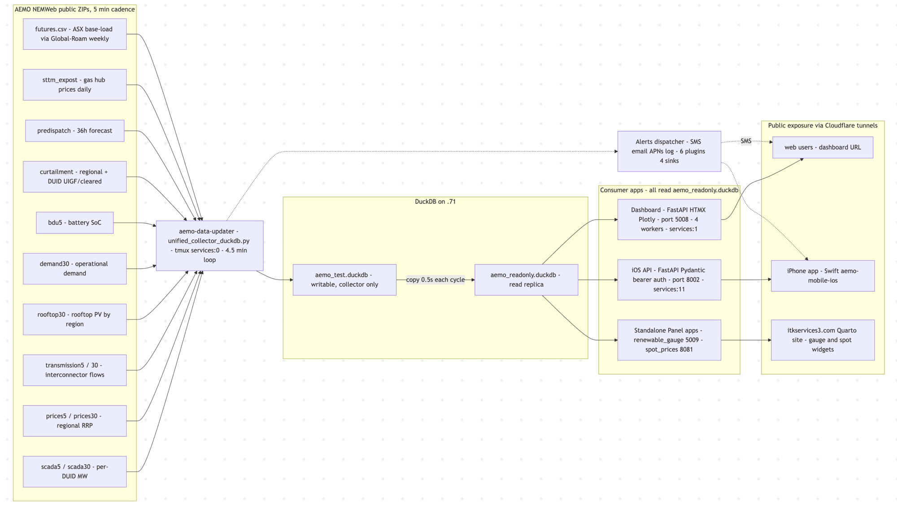

# NEM Dashboard — End-to-End Architecture

How AEMO data flows from public NEMWeb endpoints through the collector,
into DuckDB, and out to the dashboard, iOS app, and the standalone
gauges. Written so a new engineer can pick up any single component.



*Source: `architecture.mermaid` — paste into [mermaid.live](https://mermaid.live)
to edit the diagram, then export to PNG/SVG back into this folder.*

Everything runs on the **daves_mini** Mac mini (`.71`) under one
`tmux` session called `services`. Cron supervises the user-facing
dashboards (daily restart at 12:15 AM).

---

## 1. AEMO data sources

`aemo-data-updater` polls these NEMWeb endpoints. Each is a directory
listing ZIPs containing CSV dispatch / scada / price / etc. reports.

| Slug | URL | Cadence | Why |
|---|---|---|---|
| prices5 | `nemweb.com.au/Reports/CURRENT/DispatchIS_Reports/` | 5 min | regional spot price RRP |
| scada5 | `nemweb.com.au/Reports/CURRENT/Dispatch_SCADA/` | 5 min | per-DUID MW (basis of all generation) |
| transmission5 | `nemweb.com.au/Reports/CURRENT/DispatchIS_Reports/` | 5 min | interconnector flows |
| curtailment5 | `nemweb.com.au/Reports/Current/Next_Day_Dispatch/` | next day | UIGF vs cleared, region + DUID |
| trading | `nemweb.com.au/Reports/CURRENT/TradingIS_Reports/` | 30 min | settled trading-interval prices |
| rooftop | `nemweb.com.au/Reports/CURRENT/ROOFTOP_PV/ACTUAL/` | 30 min | rooftop solar MW per region |
| demand | `nemweb.com.au/Reports/Current/Operational_Demand/ACTUAL_HH/` | 30 min | operational demand per region |
| demand_less_snsg | `nemweb.com.au/Reports/Current/Operational_Demand_Less_SNSG/ACTUAL_HH/` | 30 min | demand minus significant non-scheduled gen |
| bdu5 | NEMWeb BDU dispatch | 5 min | battery-dispatch-unit state of charge |
| predispatch | NEMWeb PRE_DISPATCH | 30 min | 36-hour forecast prices + demand |
| sttm | NEMWeb STTM ex-post | daily | gas trading market hub prices + volumes |
| futures | Global-Roam CSV mirror | weekly | ASX base-load futures settlement |

ZIPs nest: outer "current" ZIP contains inner-interval ZIPs which
contain the CSV. The collector unpacks both layers, parses with
pandas/duckdb, and merges into DuckDB.

---

## 2. The collector (`aemo-data-updater`)

**Repo**: `/Users/davidleitch/aemo_production/aemo-data-updater`
**Main loop**: `src/aemo_updater/collectors/unified_collector_duckdb.py`
**Run**: `tmux services:0` (window 0)

Each cycle (every ~4.5 min):

1. For each source: list current ZIPs, identify ones we haven't seen
   yet (tracking via min/max settlementdate seen).
2. Download new ZIPs, unpack, parse CSV.
3. `INSERT ... ON CONFLICT DO NOTHING` into `aemo_test.duckdb`.
4. After all sources merge: `shutil.copy2` the writable DB on top of
   `aemo_readonly.duckdb`. ~0.5 s. Atomic-ish — readers using the
   readonly replica see consistent snapshots between cycles.
5. Run the alerts dispatcher (`dispatcher.run_cycle()`) which evaluates
   each plugin's `evaluate(ctx) -> list[Alert]` and routes to sinks.
6. Sleep ~4.5 min.

**Why two DuckDB files**: DuckDB writable-and-readonly handles can't
coexist on the same file. Splitting writer from readers via a
copy-after-write keeps the readers (dashboard, iOS, standalone) on a
stable handle that never blocks.

**Alerts** (price-breach, freshness, new-DUID, battery records,
renewable records) are detector plugins in
`aemo-energy-dashboard2/src/aemo_dashboard/alerts/plugins/`. The
collector imports them at runtime. See
[alerts_plugin_architecture.md](alerts_plugin_architecture.md) and
[alerts.md](alerts.md).

**Source-table contract**: collectors only touch their own table.
Cross-table joins happen at read time in views or in the consuming
apps. This keeps catch-up logic per-source.

**Catch-up scripts** (manual, not part of the loop):
- `backfill_gaps_to_duckdb.py --hours 168` — fills 5-min gaps from
  daily archive ZIPs.
- `backfill_30min_to_duckdb.py --hours 168` — same for 30-min tables.
- `weekly_integrity.py` (cron Sunday 04:17) — surveys gaps across 10
  tables, runs the two backfills if gaps are recent enough, logs the
  outcome.

---

## 3. DuckDB

### Files

- `aemo_test.duckdb` (writable, ~3 GB) — owned by the collector
- `aemo_readonly.duckdb` (read-only replica, same content) — consumed
  by the dashboard, iOS API, standalone gauges. All three apps pass
  `read_only=True` when connecting.

### Base tables (one source = one table)

| Table | Cadence | Cols (representative) | Approx rows |
|---|---|---|---|
| `scada5` | 5 min | settlementdate, duid, scadavalue | tens of millions |
| `scada30` | 30 min | settlementdate, duid, scadavalue | ~10M |
| `prices5` | 5 min | settlementdate, regionid, rrp | ~1M |
| `prices30` | 30 min | settlementdate, regionid, rrp | hundreds of thousands |
| `transmission5` / `transmission30` | 5 / 30 min | settlementdate, interconnectorid, meteredmwflow, mwflow, exportlimit, importlimit | millions |
| `demand30` | 30 min | settlementdate, regionid, demand, demand_less_snsg | hundreds of thousands |
| `rooftop30` | 30 min | settlementdate, regionid, power | hundreds of thousands |
| `bdu5` | 5 min | settlementdate, duid, energy_storage, ... | millions |
| `curtailment_regional5` | 5 min | settlementdate, regionid, solar_uigf, solar_cleared, solar_curtailment, wind_uigf, wind_cleared, wind_curtailment, total_curtailment | ~500k |
| `curtailment_duid5` | 5 min | settlementdate, duid, uigf, totalcleared, curtailment | ~16M |
| `predispatch` | 30 min | run_time, settlementdate, regionid, rrp_forecast, demand_forecast | millions |
| `sttm_expost` | daily | gas_date, hub, expost_price, network_allocation | ~16k |
| `duid_mapping` | static | duid, region, "site name", owner, fuel, capacity_mw, storage_mwh | ~600 |

### Views (joins / aggregations at read time)

| View | Definition |
|---|---|
| `generation_5min`, `generation_30min` | scada × duid_mapping (carries fuel/region/owner labels per DUID) |
| `generation_by_fuel_5min`, `generation_by_fuel_30min` | scada aggregated by (settlementdate, fuel_type, region) |
| `generation_enriched_30min` | scada × duid_mapping × prices_30min |
| `generation_with_prices_30min` | per-DUID generation joined to regional price |
| `hourly_by_fuel_region` | hourly resample of scada × fuel × region |
| `prices_5min`, `prices_30min` | thin renames of prices5/prices30 |
| `transmission_5min`, `transmission_30min` | renames of transmission5/30 |

**Performance gotcha**: the view-based aggregations are *fast for
multi-interval queries* (since DuckDB streams the join) but
*slow for "latest interval only"* lookups because `MAX(settlementdate)`
has to scan the view. For latest-interval reads (gauges, NEM-now
panels), query the base `scada5` table directly with a tight
`WHERE settlementdate = (...)` filter. The dashboard + iOS gauge
queries are written this way (see
[NEM_dash_contents.md](NEM_dash_contents.md) calculation reference).

### Known data caveats

- **Rooftop sub-regions** (pre-2026 only): `rooftop30` historically
  contained sub-region IDs (QLDC/QLDN/QLDS/TASN/TASS) alongside the
  five main regions. Summing across all `regionid` values
  double-counts QLD + TAS. Always filter `regionid IN ('NSW1', 'QLD1',
  'VIC1', 'SA1', 'TAS1')` when summing. See
  [memory: rooftop-subregion-bug](../memory/rooftop_subregion_bug.md).
- **prices30 / transmission30 contamination** (historical): 30-min
  tables contained off-grid 5-min rows from a one-off bulk load.
  Cleaned 2026-05-10 (`transmission30` 2.4M → 668k rows).
  `prices30` cleaned in a subsequent session. See memory: transmission30
  cleaned (10 May 2026).
- **NaN handling**: LP-infeasible periods in dispatch can produce NaN
  prices. Always filter before computing means.

---

## 4. Consumers

### 4a. Dashboard (web)

**Repo / worktree**: `/Users/davidleitch/aemo-redesign` (git worktree of
`aemo-energy-dashboard2` on branch `web-dashboard-redesign`).

**File**: `src/aemo_dashboard/web/app.py` (~9000 lines, single-file
intentionally — keeps the routing + content + helpers in one place).

**Stack**: FastAPI + HTMX + Plotly.js + Tabulator (loaded from CDN).
No Node toolchain. Tabulator state lives in the browser; HTMX swaps
the tab body without reloading the page chrome.

**Run**:
```
cd /Users/davidleitch/aemo-redesign/src/aemo_dashboard/web
.venv/bin/uvicorn app:app --host 0.0.0.0 --port 5008 --workers 4
```

**Workers**: 4 worker processes (each ~150 MB). Per-worker in-process
TTL cache (`_TILE_CACHE` dict) on slow tile endpoints — 30 s for
DB-backed tiles, 120 s for external-fetch tiles.

**Tabulator shell**: Tabulator CSS + JS load once in the shell
`<head>` so HTMX swaps don't re-fetch them. Construction is hooked off
`htmx:afterSettle` so the table builds **after** layout — fixes the
zero-width-fitColumns bug.

**Tab list / structure**: see
[NEM_dash_contents.md](NEM_dash_contents.md).

### 4b. iOS API

**Module**: `aemo_dashboard.api.main:app` in
`/Users/davidleitch/aemo_production/aemo-energy-dashboard2`.

**Run**:
```
.venv/bin/uvicorn aemo_dashboard.api.main:app --host 127.0.0.1 --port 8002
```
(behind Cloudflare Access — token in `~/.config/aemo-api/tokens.yaml`.)

**Auth**: bearer token middleware (`api/auth.py`). Tokens loaded from
the yaml file via `API_TOKENS_FILE` env var. Each token has a name
for logging.

**Endpoints** (`api/routers/`):
- `today.py` — landing payload
- `gauges.py` — `GET /v1/gauges/today` (demand + renewable + battery
  for the iPhone home tab; 60 s TTL cache)
- `generation.py` — per-interval / aggregated generation for any
  window
- `generation_comparison.py` — year-on-year fuel summary
- `prices.py` — spot price series
- `evening_peak.py` — evening peak data
- `trends.py` — penetration trends
- `outages.py` — PASA outages
- `stations.py` — DUID / station lookup
- `batteries.py` — battery economics
- `futures.py`, `gas.py` — ASX futures + STTM gas
- `devices.py` — `POST /v1/devices/register` (APNs token registration)
- `meta.py` — health + version

**Swift app**: separate repo at `aemo-mobile-ios` on GitHub. The iOS
build talks to `/v1/...` over HTTPS via the iOS API's Cloudflare tunnel.

### 4c. Standalone Panel apps

Two long-lived Panel apps run alongside the dashboard:

| App | Port | tmux | Purpose |
|---|---|---|---|
| `renewable_gauge_stacked.py` | 5009 | `services:2` | embedded gauge for the Quarto site (loads quickly because it queries `scada5` directly with a tight time filter) |
| `display_spot.py` (panel serve) | 8081 | `services:3` | spot-price strip widget for the Quarto site |

Both read from `aemo_readonly.duckdb`. Both are independent FastAPI/
Panel processes — they don't share memory with the dashboard or iOS
API.

### 4d. Alerts pipeline

Runs inside the collector (`unified_collector_duckdb.py`):
- Plugins (`alerts/plugins/`) define `evaluate(ctx) -> list[Alert]`.
- Sinks (`alerts/sinks/`) define `emit(alert)`: `LogSink`,
  `TwilioSmsSink`, `SmtpEmailSink`, `ApnsPushSink`.
- Routing table (`ALERT_ROUTING`) maps alert IDs → list of sink names.
- Dispatcher orchestrates per-cycle.

Six plugins:
- `price_breach` — $1k / $10k spike alerts per region (SMS + APNs)
- `data_freshness` — alert when a table's MAX(settlementdate) lags
- `new_duid` — alert when a new auto-classified DUID lands
- `battery_records` — 15 records over BDU history (SMS — shadow mode)
- `battery_low_soc` — 8 low-SOC alerts (SMS — shadow mode)
- `renewable_records` — 5 fuel records (SMS — shadow mode)

Catalogue at [alerts.md](alerts.md); architecture at
[alerts_plugin_architecture.md](alerts_plugin_architecture.md).

---

## 5. Supervision

### tmux topology

| Window | Name | Process |
|---|---|---|
| 0 | collector | `unified_collector_duckdb.py` |
| 1 | itk-dashboard | redesign uvicorn on 5008 (was Panel `run_dashboard_duckdb.py`) |
| 2 | renewable-gauge | `renewable_gauge_stacked.py --port 5009` |
| 3 | spot-prices | `panel serve display_spot.py --port=8081` |
| 4 | iea-global | unrelated (international stats) |
| 5 | isso-comments | comment server |
| 6 | monitor | utility shell |
| 7 | outage-monitor | standalone PASA monitor |
| 8 | karen-gallery | photo site |
| 9 | battery-monitor | standalone battery records SMS daemon (shadow) |
| 10 | cloudflared-… | Cloudflare tunnel daemon |
| 11 | nemgenapi | iOS API uvicorn on 8002 |

Sessions live on tmux server started at boot. iTerm2 control-mode
(`ssh -t davidleitch@192.168.68.71 tmux -CC attach -t services`)
maps windows to native tabs.

### Cron-managed restart

**Script**: `/Users/davidleitch/tmux_files/restart_dashboards.sh`
**Schedule**: 12:15 AM daily via cron.

What it does:
1. Send `Ctrl-C` to `services:1` (dashboard), wait, send the launch
   command.
2. Same for `services:2` (gauge) and `services:3` (spot prices).
3. Sleep 10 s, verify each process is up via `pgrep`, log result to
   `/Users/davidleitch/tmux_files/restart_log.txt`.

Backup of the pre-redesign script is at
`restart_dashboards.sh.bak.before_redesign`. Rollback to Panel:
copy the backup back and re-run the script.

### Other supervised jobs

- `weekly_integrity.py` cron at 04:17 AM Sunday → DuckDB gap survey.
- `battery_monitor.py` cron / always-on → battery records SMS daemon
  (will be retired once the Alerts plugin shadow-comparison
  confirms parity).

### Logs

| Process | Log |
|---|---|
| collector | `/Users/davidleitch/aemo_production/aemo-data-updater/logs/collector_duckdb.log` |
| dashboard / gauge / spot | stdout of their tmux pane; only the cron-restart writes to `restart_log.txt` |
| iOS API | stdout of tmux services:11 (no file logging configured) |
| weekly_integrity | `/Users/davidleitch/aemo_production/logs/db_integrity.log` |
| alerts (logged sink) | mixed into `collector_duckdb.log` |

---

## 6. Public exposure

Cloudflare tunnels (one tunnel process per public hostname, run
via `cloudflared` in `services:10`).

| Public hostname | Local target | Purpose |
|---|---|---|
| (dashboard) | `:5008` | redesigned dashboard |
| (iOS API) | `:8002` | `/v1/*` for the iPhone app |
| `spot_prices.itkservices2.com` | `:8081` | spot-prices widget on Quarto site |
| `gauge.itkservices2.com` (probably) | `:5009` | renewable-gauge widget on Quarto site |

The tunnel is what determines the public DNS; swapping which app
listens on a port is invisible to users (this is how the production
cutover happened: dashboard redesign took over `:5008` from the old
Panel app without touching Cloudflare config).

Authentication for the iOS endpoint is bearer-token at the FastAPI
layer (not at the tunnel). Cloudflare Access could be added per
hostname if SSO becomes desirable.

---

## 7. Source layout recap

```
/Users/davidleitch/
├── aemo_production/
│   ├── data/
│   │   ├── aemo_test.duckdb            # writable, owned by collector
│   │   └── aemo_readonly.duckdb        # read replica, consumed by apps
│   ├── aemo-data-updater/              # the collector
│   │   └── src/aemo_updater/collectors/
│   │       ├── unified_collector_duckdb.py    # the main loop
│   │       └── ...
│   └── aemo-energy-dashboard2/         # main branch checkout
│       └── src/aemo_dashboard/
│           ├── api/                    # iOS API
│           │   ├── main.py
│           │   ├── auth.py
│           │   ├── db.py
│           │   └── routers/...
│           ├── alerts/                 # alerts pipeline (plugins/sinks)
│           ├── pasa/                   # PASA tab (still Panel, not yet ported)
│           ├── curtailment/            # production curtailment tab (broken, retired)
│           └── ...
├── aemo-redesign/                      # web-dashboard-redesign worktree
│   ├── src/aemo_dashboard/web/
│   │   ├── app.py                      # the dashboard (single file)
│   │   ├── today_body.html
│   │   └── ...
│   └── docs/
│       ├── NEM_dash_contents.md        # what each card shows + formulae
│       └── architecture.md             # this file
├── tmux_files/
│   ├── restart_dashboards.sh           # cron-managed daily restart
│   └── restart_dashboards.sh.bak.before_redesign
└── .config/aemo-api/
    ├── tokens.yaml                     # iOS API bearer tokens (do not commit)
    └── apns/                           # APNs .p8 key for push notifications
```

---

## 8. Where to dig next

If you're working on:

- **A new tab on the dashboard** — start in `aemo-redesign/src/aemo_dashboard/web/app.py`. Pattern: write a `_xxx_content(...)` builder, a route handler, and skip in the flat-route loop. Inventory in [NEM_dash_contents.md](NEM_dash_contents.md).
- **A new metric** — add the formula to the [calculation reference](NEM_dash_contents.md#calculation-reference) before coding it. Cite the section name from the card description.
- **Slow tile / query** — first check whether you're reading from a view. View-based "latest" queries scan everything. Rewrite to query the base table directly with a tight `WHERE`. See `_build_renewable_gauge` for the pattern.
- **Data freshness / a missing source** — collector logs at `collector_duckdb.log`. Survey gaps with `weekly_integrity.py --check-only`.
- **iOS endpoint** — add a router under `api/routers/`, mount in `api/main.py`. Bearer auth is automatic.
- **A new alert** — write a plugin in `alerts/plugins/`, add it to `build_default_dispatcher()`, route it in `ALERT_ROUTING`. See [alerts_plugin_architecture.md](alerts_plugin_architecture.md).
- **Restart / deployment** — edit `tmux_files/restart_dashboards.sh`, run it, watch `pgrep` confirm each process. Backup the existing script first.
